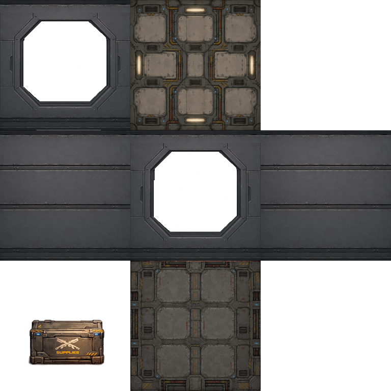

# Phaser 4 Interior Mapping Demo

A focused Phaser 4 + Vite demo for an interior mapping shader. The scene renders a 10x10 grid of flat room sprites, each using the same 3x3 room atlas and an internal Phaser filter to fake a 3D room behind the facade.

## Run

Install dependencies:

```bash
npm install
```

Start the Vite dev server:

```bash
npm run dev
```

Build the production bundle:

```bash
npm run build
```

Create a custom interior atlas:

```bash
npm run create:interior-atlas -- -h
```

The demo uses Phaser's WebGL renderer because the effect is implemented as a custom Phaser 4 render node and fragment shader. Canvas rendering cannot run this filter.

## Controls

Use `W`, `A`, `S`, and `D` to move the main camera vertically and horizontally across the room grid. Arrow keys work too. As the camera moves, every room receives a different virtual `cameraX` and `cameraY` value based on its position relative to the visible camera center.

Use `Z` to zoom in and `X` to zoom out.

The floating `lil-gui` panel has a `Single room mode` switch:

- Off: shows the 10x10 grid with randomized room filter values.
- On: shows one centered room and exposes every `InteriorMappingFilter` option for realtime editing.
- `Reset single room`: restores the single-room filter controls to the demo defaults.
- `Export config`: opens a modal with highlighted TypeScript code for the current single-room filter configuration. Use the copy icon button in the modal header to copy the snippet.

In single-room mode, changing values such as `cameraX`, `cameraY`, `viewWidth`, `viewHeight`, `roomDepth`, `midGroundDepth`, `midGroundX`, `midGroundY`, `midGroundScale`, `midGroundAlpha`, `frontWallAlpha`, `chromaKeyColor`, `chromaKeyTolerance`, `brightness`, and the wall/ceiling/floor tiling options updates the active filter immediately. `viewWidth` and `viewHeight` also resize the displayed room sprite, so the whole room changes aspect instead of only changing the midground projection.

The export modal uses `highlight.js` for TypeScript highlighting. It was chosen over heavier highlighters because this demo only needs a small, synchronous browser-side snippet viewer.

## Atlas Layout

The shader samples from one `3x3` atlas texture. The included demo asset is `public/assets/boxwindow-shader.png`.



```text
row 0: [ frontWall ] [ ceiling  ] [ empty ]
row 1: [ leftWall  ] [ backWall ] [ rightWall ]
row 2: [ midGround ] [ floor    ] [ empty ]
```

The source sprite is the atlas itself. The filter replaces the visible sprite pixels by sampling the atlas cells that correspond to the virtual room surface hit by the shader ray.

## Creating A Custom Atlas

This project includes `scripts/create-interior-atlas.mjs`, copied from the sibling `phaserjs-filters/scripts` folder. It stitches separate room images into the exact `3x3` atlas layout expected by `InteriorMappingFilter`.

Run the CLI through npm:

```bash
npm run create:interior-atlas -- \
  --frontWall ./room-parts/front.png \
  --ceiling ./room-parts/ceiling.png \
  --leftWall ./room-parts/left.png \
  --backWall ./room-parts/back.png \
  --rightWall ./room-parts/right.png \
  --midGround ./room-parts/midground.png \
  --floor ./room-parts/floor.png \
  --size 256 \
  --fit contain \
  --background transparent \
  --out ./public/assets/my-room-atlas.png
```

Then load the generated atlas in `src/main.ts` instead of `boxwindow-shader.png`.

The output PNG is always square and always three cells wide by three cells tall. With `--size 256`, the result is `768x768`.

Useful options:

- `--out <file>`: required output PNG path.
- `--size <px>`: cell size. If omitted, the script uses the first input image width.
- `--fit contain`: keep each source image aspect ratio with transparent padding.
- `--fit cover`: keep aspect ratio and crop overflow so each cell is filled.
- `--fit fill`: stretch each source image to the cell.
- `--background transparent`: keep missing cells transparent.
- `--background #RRGGBB`: use a solid atlas background color.

You can omit any room image input. Missing cells remain transparent, which is useful while iterating on only the front wall, back wall, or midground.

## How Interior Mapping Works

Interior mapping makes a flat quad look like a room with depth. For each screen pixel, the fragment shader:

1. Converts the pixel UV into a point on the front window plane.
2. Builds a ray from a virtual camera position, `cameraX`, `cameraY`, `-1`, through that front plane.
3. Intersects the ray with a virtual box: back wall, left wall, right wall, floor, and ceiling.
4. Chooses the nearest valid hit and samples the matching cell in the atlas.
5. Blends in an optional midground layer and the front wall/window layer using black chroma keying.

The trick is that nothing is modeled in 3D. The apparent depth comes from changing where each ray hits the room box as the camera moves.

## Camera Parallax

In `src/main.ts`, the Phaser camera center is compared to each room sprite's world position. That relative offset is normalized and clamped to `[-1, 1]`, then assigned to the room filter:

```ts
room.filter.cameraX = Phaser.Math.Clamp((cameraCenterX - room.sprite.x) / influence, -1, 1);
room.filter.cameraY = Phaser.Math.Clamp((cameraCenterY - room.sprite.y) / influence, -1, 1);
```

Rooms near the left, right, top, or bottom of the viewport get different virtual camera offsets, so their interiors appear to shift independently while the sprites remain flat.

## Filter Tuning Examples

The filter options live in `src/filters/interior-mapping/InteriorMappingFilter.ts`, and the demo values are passed when each room is created in `src/main.ts`.

```ts
addInteriorMappingFilter(sprite, {
  roomDepth: 1.85,
  midGroundDepth: 0.45,
  frontWallAlpha: 1,
  brightness: 1.05,
});
```

- `roomDepth`: Increases or decreases the distance to the back wall. Higher values make the room feel deeper.
- `midGroundDepth`: Places the midground atlas cell between the front window and the back wall. Smaller values bring it closer to the viewer.
- `frontWallAlpha`: Controls how strongly the front wall/window cell overlays the generated room.
- `brightness`: Multiplies the sampled room colors after the shader's wall shading.
- `leftWallTiled`, `rightWallTiled`, `ceilingTiled`, `floorTiled`: Repeats that surface's atlas cell instead of stretching it across the whole virtual surface.
- `leftWallTileSizeX/Y`, `rightWallTileSizeX/Y`, `ceilingTileSizeX/Y`, `floorTileSizeX/Y`: Controls the repeat size separately on each surface UV axis. `1` means one copy across that axis; `0.25` means four repeats across that axis.

For a deeper room with a softer facade:

```ts
addInteriorMappingFilter(sprite, {
  roomDepth: 2.6,
  midGroundDepth: 0.35,
  frontWallAlpha: 0.75,
  brightness: 1.15,
  floorTiled: true,
  floorTileSizeX: 0.5,
  floorTileSizeY: 0.25,
  leftWallTiled: true,
  leftWallTileSizeX: 0.35,
  leftWallTileSizeY: 0.5,
  rightWallTiled: true,
  rightWallTileSizeX: 0.35,
  rightWallTileSizeY: 0.5,
});
```

For a flatter, graphic look:

```ts
addInteriorMappingFilter(sprite, {
  roomDepth: 0.95,
  midGroundAlpha: 0.55,
  frontWallAlpha: 1,
  brightness: 0.9,
});
```

## Future TODO

- Add a dynamic interior item system for multiple midground objects instead of relying only on the atlas `midGround` cell.
- Keep the shader responsible for the room shell: back wall, side walls, ceiling, floor, and front wall/window.
- Add a `RoomInteriorLayer` that owns an array of Phaser objects placed inside a room.
- Give each item its own config: image or sprite key, animation key, normalized room position, depth, scale, alpha, velocity, and static/moving behavior.
- Mirror the shader projection math in TypeScript so each item's room-space position can be projected into world/screen coordinates every frame.
- Support static props, animated sprites, and moving entities such as a player walking inside the room.
- Sort dynamic items by depth so farther objects render behind nearer objects.
- Add masking/clipping so dynamic sprites cannot spill outside the visible room/window opening.
- Render the front wall/window layer above dynamic items so the frame can occlude them naturally.
- Consider disabling the shader's built-in `midGround` layer when dynamic Phaser sprites are used, or keep it only for static background dressing.

## Inspiration

This demo was inspired by these interior mapping writeups:

- [Interior Mapping: Rendering Real Rooms without Geometry](https://80.lv/articles/interior-mapping-rendering-real-rooms-without-geometry)
- [Interior Mapping Shader by Julius Ihle](https://julius-ihle.de/?p=2451)
